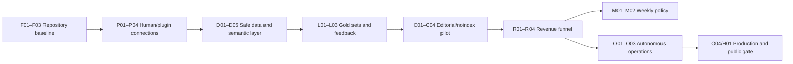

# 現時点の全導入マスタープラン

基準日: 2026-07-26（Asia/Tokyo）

この文書を「何を、いつ、誰が、どの条件で導入するか」のHuman向け正本とする。
機械可読の正本は`docs/CURRENT_ADOPTION_REGISTRY.json`、非Human実装の完了証拠は
`docs/CURRENT_ADOPTION_IMPLEMENTATION_STATUS.json`、本人操作だけの表は
`docs/CURRENT_ADOPTION_ACTIONS.md`である。

## 結論

導入対象は37件ある。ただし、**導入可能**と**本番有効化可能**は別である。

一時制約として、2026-07-31まではカード不要モードを採用する。Google Workspace、domain購入、
OpenAI API、外部AI課金、cloud、hosting、有料trialは順序を後ろへ送り、無料登録、許諾照会、
ローカル品質検証だけを先行する。外部送信・規約同意・account作成は無料でも個別Human GOを必要とする。

|状態|件数|意味|
|---|---:|---|
|existing|8|既に利用可能。運用ルールだけ固定する|
|ready_local|16|外部accountなしでlocal実装を開始できる|
|ready_human|5|本人のaccount、OAuth、契約、remote等が必要|
|after_evidence|6|技術導入は可能だが実データ後に有効化する|
|deferred_gate|2|規模条件まで導入しない|

最初の順番は、`repository baseline → Human接続 → semantic/gold set → noindex記事 → causal funnel`
である。外部AI、Langfuse、cloudの先行導入は行わない。

## 状態とWave

- Wave 0（0–3日）: local foundation、schema、skills、計測定義。
- Wave 1（1週）: Humanがplugin/account/data accessを接続。
- Wave 2（2–4週）: safe export、10–15 noindex記事、学習loop。
- Wave 3（1–3か月）: 実観測でscheduler、monitoring、外部criticを有効化。
- Wave 4（traction後）: cloud、public hosting、scale stack。

## 全導入台帳

### Foundation / plugin / data

|ID|項目|状態|Wave|owner|依存|完了条件|
|---|---|---|---:|---|---|---|
|F01|初回immutable Git baseline|existing|0|Codex + Human review|なし|2026-07-26にP18の500-file scopeをHuman確認後、初回commit済み|
|F02|GitHub remote|existing|1|Human|F01|2026-07-28にsecret・著者情報を検査後public化し、匿名HTTP 200を確認済み。未commit変更は未公開|
|F03|GitHub Actions/Dependabot/Gitleaks実稼働|existing|1|Codex + Human|F02|2026-07-26にremote CIのPython/Web/lock/schema/secret checksを全合格read-back済み|
|P01|Google Drive plugin/evidence vault|existing|1|Human + Codex|なし|2026-07-26に専用folderと7分類を作成。safe-summaryだけを受け入れる|
|P02|Gmail rights/Affiliate inbox|existing|1|Human + Codex|なし|専用label/query、送信前Human GO、返信監視|
|P03|Google Calendar expiry/renewal|existing|1|Human + Codex|P01|2026-07-26に非公開専用calendarとrights 30/90/180日・Affiliate月次の5予定を作成・read-back済み|
|P04|Notion editorial UI|after_evidence|3|Human|F02|GitHub Issuesで不足と判定した場合だけ導入。二重正本を作らない|
|D01|Google Ads以外のJP/ja需要export|ready_human|1|Human + Codex|provider rights + Human export|日本/日本語、frozen universe、rawとsafe summary分離。第一候補はMangools KWFinder CSVだがrights回答まで取込禁止|
|D02|Search Console read-only intake|ready_human|1|Human + Codex|property ownership|query/page/country/device/date、row limitと欠測を記録|
|D03|GA4 read-only intake|ready_human|1|Human + Codex|GA4 property|qualified session/comparison/outbound event definitionを固定|
|D04|Affiliate export adapters|ready_human|1|Human + Codex|3 program approval|partner別click/transaction/status/currency/snapshotをsafe summary化|
|D05|Data Analytics semantic layer|ready_local|0|Codex|R01 draft|modeled/observed、metric version、source、expiryを分離|

### Learning / policy / editorial / revenue

|ID|項目|状態|Wave|owner|依存|完了条件|
|---|---|---|---:|---|---|---|
|L01|5種gold set|ready_local|0|Codex + Human labels|D05|field、policy、brief、claim/citation、CTA/conversionのfixtureとacceptance|
|L02|prompt/model run ledger|ready_local|0|Codex|A01 design|model snapshot、prompt hash、cost、latency、eval、artifact ID|
|L03|page/query/partner/cohort feedback join|ready_local|2|Codex|D02–D04,R01|同一IDでimpressionからpaidまで追跡、欠測をunknown保持|
|M01|施策proposal contract/EVI|ready_local|0|Codex|D05|impact、confidence、cost、time-to-signal、reversibility、kill条件|
|M02|週次3案policy memo|ready_local|2|Codex + Human decision|M01,L03|保守/均衡/攻めの3案とdecision receipt|
|C01|content ontology/brief schema|ready_local|0|Codex|D05|比較、料金、代替、適合、移行、methodologyの6型|
|C02|claim-evidence map/3-draft QA|ready_local|0|Codex|C01,L01|analyst/editor/skeptical buyer、unsupported claim 0|
|C03|10–15 high-intent noindex pilot|ready_local|2|Codex + Human sample|C02,rights|全field current、CTA disabled/approved、refresh trigger|
|C04|X/email/chart derivatives|after_evidence|3|Codex + Human publish|C03|canonical article合格後だけ生成、単独正本にしない|
|R01|causal funnel event taxonomy/IDs|ready_local|0|Codex|D05|property/content/query/campaign/CTA/cohort IDと除外規則|
|R02|CTA health/disclosure audit|ready_local|2|Codex|R01,affiliate approval|broken/expired/mismatched link自動disable、広告表示合格|
|R03|settlement reconciliation|ready_local|2|Codex|D04,R01|pending/confirmed/paid/refundをappend-onlyで一致|
|R04|KPI dashboard/scorecard|ready_local|2|Codex|L03,R03|qualified sessions、confirmed EPC、profit、human minutes、quality|

### AI / skills / automation / production

|ID|項目|状態|Wave|owner|依存|完了条件|
|---|---|---|---:|---|---|---|
|A01|OpenAI Responses model router|ready_human|1|Human billing + Codex|L01,L02|Luna=bulk、Terra=draft、Sol=policy/QAをgold setで比較|
|A02|ChatGPT Pro sampled critic|existing|0|Codex|C02,M01|高価値artifactの10–20%だけblind critique|
|A03|Claude/Gemini challenger benchmark|after_evidence|3|Human billing + Codex|100 evaluated runs|品質+5%または費用/latency-30%でのみ採用|
|A04|Langfuse/equivalent tracing|after_evidence|3|Codex + Human hosting|100 meaningful AI runs/month|trace、dataset、offline/online eval、retention確認|
|S01|`saas-content-editorial` skill|ready_local|0|Codex|C01,C02|brief→3 draft→claim QA→derivativeの固定workflow|
|S02|`saas-growth-policy` skill|ready_local|0|Codex|M01|evidence→3 options→rank→killの固定workflow|
|S03|`affiliate-export-intake` skill|ready_local|0|Codex|R01,D04 contract|raw外置き、safe summary、funnel reconciliation|
|O01|durable scheduler/queue|after_evidence|3|Codex|30-day scope,approved sources|idempotency、bounded retry、dead letter、99% job target|
|O02|approval inbox/kill switch|existing|0|Codex + Human|P11–P21|exact action、expiry、revocation、STOPが一画面で確認可能|
|O03|telemetry/dead-man alert|after_evidence|3|Codex|O01|freshness、failure、cost、expiry、no receiptを通知|
|O04|cloud runtime/DB/KMS/anchor/backup|deferred_gate|4|Human + Codex|public GO|1 stackだけ選択、restore/RPO/RTO/rollback合格|
|H01|Sites hosting/publication|deferred_gate|4|Human + Codex|P16/P18/public GO|noindex staging、readback、rollback後にexact publish GO|

## 導入順序

### Wave 0 — Codexがlocalで準備できる範囲

1. F01のbaseline範囲とverification receiptを固定。
2. D05/R01のsemantic・funnel contractを先に作る。
3. L01/L02、C01/C02、M01を同じID体系で作る。
4. S01–S03を小さなskillsとして実装する。
5. C03のnoindex記事templateとR02/R03/R04のfixtureを作る。

### Wave 1 — あなたの接続作業と並行

1. F01–F03、P01、P03は接続・remote CIまで完了。
2. D01–D04をread-onlyまたはmanual exportで開始。
3. A01のAPI key/billing capを本人が設定し、keyはrepoへ入れない。
4. F03 remote CIを初回実行する。

### Wave 2 — 実データの薄い学習loop

1. safe summaryをD05へ取り込む。
2. `INITIAL_LEARNING_QUALITY_GATE.md`の署名付き初期品質gateを通し、低品質・合成・古いbatchを学習前に停止する。
3. 10–15 noindex記事を作成し、Humanは標本だけ確認する。
4. GSC/GA4/AffiliateをL03で結合する。
5. M02が週次3案を出し、継続・修正・停止を記録する。

### Wave 3–4 — trigger後

- O01/O03、A03/A04、C04は実volumeができてから有効化する。
- O04/H01はrights、Affiliate、production evidence、Human public GO後だけ。

## モデル・plugin方針

- OpenAIの現行モデル選択は[公式model guidance](https://developers.openai.com/api/docs/guides/latest-model)を正本とする。
- Driveは専用folderまたはshared drive、最小scope、rawとsafe summaryの分離を行う。
- Search Consoleはtop rowsの制限を持つため「全query取得済み」と解釈しない。
- GA4のreporting identity、sampling/aggregation情報をartifactに残す。
- Geminiはstable model IDをpinし、preview/latest aliasをproduction defaultにしない。
- Claude/Geminiを同時本番導入しない。A03 benchmarkで1社だけ採用する。

## 一律停止条件

- credential、PII、tracking ID、非公開報酬がprompt、repo、logへ入る。
- source rights、Affiliate status、data expiryがunknown/expired。
- canonical DB、public release、affiliate linkへのAI直接write。
- gold setなしのmodel変更、`latest` aliasの無検証本番利用。
- event定義をcohort途中で変更しながら同一KPIとして集計。
- Notion/GitHub/Driveの3か所に異なる正本を作る。
- O04/H01をsynthetic passだけで有効化する。

## 参照先

- 本人操作: `docs/CURRENT_ADOPTION_ACTIONS.md`
- machine registry: `docs/CURRENT_ADOPTION_REGISTRY.json`
- non-Human implementation evidence: `docs/CURRENT_ADOPTION_IMPLEMENTATION_STATUS.json`
- 既存本人manual: `docs/HUMAN_ACTION_MANUAL.md`
- production gate: `docs/PRODUCTION_ROADMAP.md`
- measurement: `docs/MEASUREMENT_MODEL.md`
- implementation evaluation: `.workflow/current-implementation-capability-audit-16-process/`
- owned-data bootstrap quality: `docs/INITIAL_LEARNING_QUALITY_GATE.md`
- historical 46-candidate catalog: `.workflow/saas-comparison-implementation-stack-16-process/results/adoption-catalog.md`

外部仕様: [GitHub Actions](https://docs.github.com/actions/using-workflows/about-workflows)、
[Google Drive API](https://developers.google.com/workspace/drive/api/guides/about-sdk)、
[Search Console API](https://developers.google.com/webmaster-tools/v1/searchanalytics/query)、
[GA4 Data API](https://developers.google.com/analytics/devguides/reporting/data/v1)、
[Google Ads Keyword Ideas](https://developers.google.com/google-ads/api/docs/keyword-planning/generate-keyword-ideas)、
[Gemini models](https://ai.google.dev/gemini-api/docs/models)、
[Claude models](https://platform.claude.com/docs/en/about-claude/models/overview)、
[Langfuse observability](https://langfuse.com/docs/observability/overview)。
